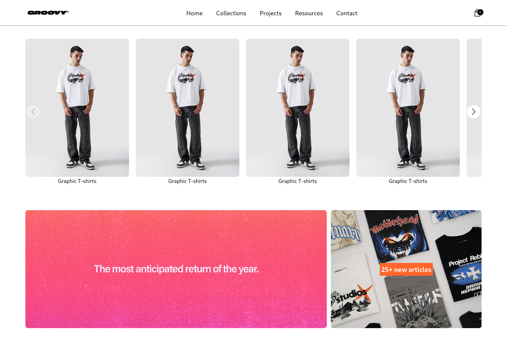
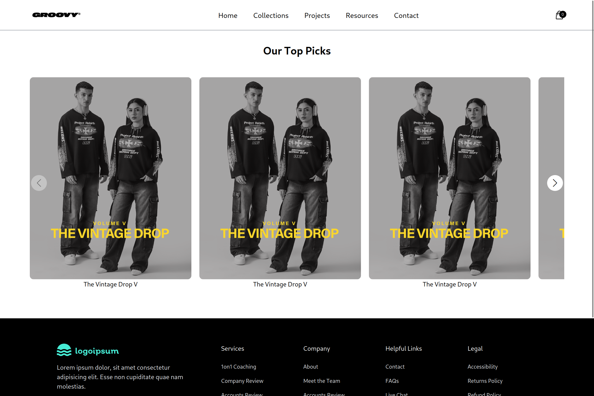

# 🛍️ Groovy Store – eCommerce Frontend Clone

**Groovy Store** is a sleek and modern frontend clone of an eCommerce website, most of the design is inspired by [Groovy Pakistan](https://groovypakistan.com/). It showcases an intuitive UI built for high performance and seamless user experience, using the latest frontend technologies.

> ⚠️ This is a frontend-only project using dummy product data with no backend integration.

---

## ✨ Features

- **Fully Responsive Layout**: Optimized for mobile, tablet, and desktop.
- **Product Grid & Details Page**: Beautiful product cards and dynamic routing.
- **Image Carousel**: Smooth product sliders powered by **Swiper**.
- **Category-Based Navigation**: Organized sections for user-friendly browsing.
- **Modern UI/UX**: Designed with Tailwind CSS for speed and consistency.
- **Fast Build**: Built with **Vite** for ultra-fast development and builds.

---

## 🛠️ Tech Stack

- **Framework**: [React](https://reactjs.org/)
- **Bundler**: [Vite](https://vitejs.dev/)
- **Styling**: [Tailwind CSS](https://tailwindcss.com/)
- **Carousel**: [SwiperJS](https://swiperjs.com/)

---

## 🚀 Getting Started

To run this project locally:

### 1. Clone the Repository

```bash
git clone https://github.com/MudassirDev/groovy-store.git
cd groovy-store
```

### 2. Install Dependencies

```bash
npm install
```

### 3. Start Development Server

```bash
npm run dev
```

Visit http://localhost:5173 in your browser to view the app.


### 🤝 Contributing

Contributions are welcome! If you’d like to improve the design, add animations, or refactor code:

    Fork the repo

    Create a new branch: git checkout -b feature-name

    Commit your changes: git commit -m "Add feature"

    Push to the branch: git push origin feature-name

    Open a pull request

### 📸 Screenshots


